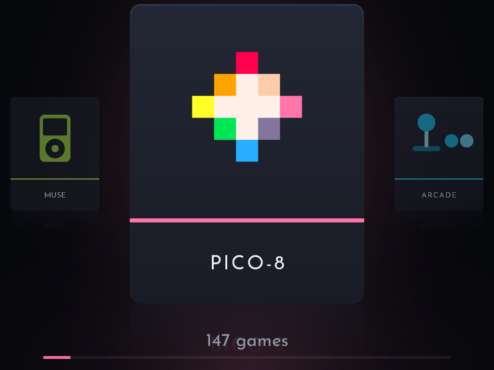
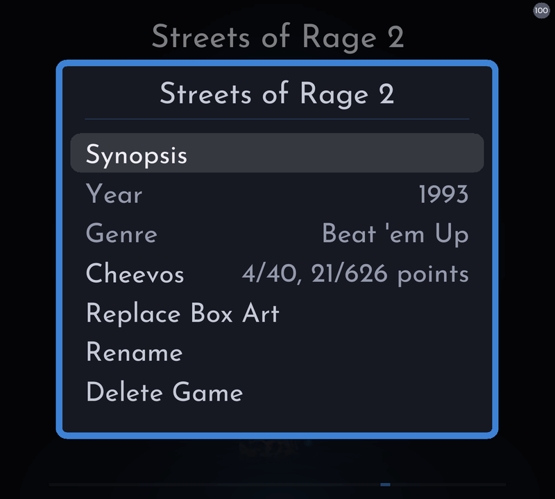
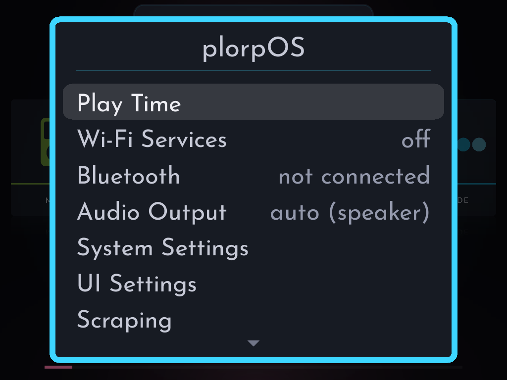
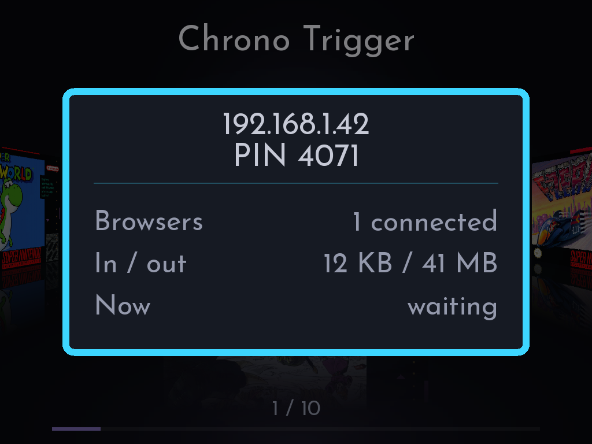

<p align="center">
  
  &nbsp;&nbsp;&nbsp;&nbsp;
  
</p>

<p align="center">
  <b>A <ins>fast</ins>, focused custom firmware for the GKD 350H Ultra and the TrimUI Brick and Brick Hammer.</b><br>
  Plays fifteen classic consoles, and gets out of your way.
</p>

<p align="center">
  <a href="#install">Install</a> &nbsp;·&nbsp;
  <a href="#supported-systems">Systems</a> &nbsp;·&nbsp;
  <a href="#controls">Controls</a> &nbsp;·&nbsp;
  <a href="#faq">FAQ</a>
</p>

## What plorpOS adds

**plorpOS** is a fork of TortOS that grew into its own project. Everything
TortOS does, it still does. On top of that:

**More handhelds**

- **The GKD 350H Ultra.** plorpOS runs on top of the GKD's own system,
  ROCKNIX, and changes nothing in it: take the card out and it starts
  EmulationStation again. The shelf is drawn at the screen's own resolution,
  not stretched, and its game cards are bigger. Wi-Fi, SSH, Samba and
  **Syncthing** are switches in the menu. See
  [Installing on the GKD](docs/install-gkd.md).
- **The Brick Pro** is in the works, but not supported in this release.

**More to play**
- **See updated "Supported Systems" table below for details**
- **PlayStation,** at twice its own resolution on the GKD. A multi-disc game
  is one card: give it an `.m3u` and the in-game menu gets a Disc row, and the
  game comes back on the disc you left it on.
- **Arcade and Neo Geo,** through FBNeo, listed by each game's real title
  rather than its zip's name.
- **PICO-8.** Carts play in fake-08 by default, with full save state and rewind functionality. 
  - Native PICO-8 with Splore is also fully supported (seriously, buy it) - Just put your raspberry-pi files in `Bios/` and switch the shelf.
  - A cart you play in Splore lands on the shelf with its full artwork.
- **Sega CD,** on the Genesis shelf.
- **Achievements for disc games and arcade sets**

**In a game**

- **Rewind:** about thirty seconds of it, on every console, at the speed you pick, from 1x to 10x. A PlayStation game on the Brick holds less, 6 to 15 seconds.
- **Configurable hotkeys** for Fast-forward, rewind, quick save, quick load and
  screenshots. Hotkeys can be set with or without a modifier button (4 options on the GKD) and persist per console.
- **Shaders:** fifteen of them, scanlines to LCD grids and Pixel
  Transparency, on the in-game menu's Shader row, on both devices. Each console remembers its own.
- **Screenshots:** a hotkey saves a PNG of the screen, shader included, to
  `Screenshots/` on the card.
- **Stretch, Aspect or Integer** display modes on every console.
- **Game Boy palettes:** sixteen to pick from per game, or Auto, which colors a game the way a Game Boy Color would.

**On the shelf**

- **Your gamelist.xml metadata** can be imported on the device to avoid needing to re-scrape.
- **Rename,** on a game's info screen: your name for it, on every shelf.
- **Battery percentage** in the corner, under System Settings.
- **Delete Game,** on a game's info screen. The game goes; its saves, art and
  play time stay.
- **A Saves folder per console,** so two games with the same name on two
  consoles never share a save.

**Music**

- **Music keeps playing through sleep.** A tap of POWER, or the configurable idle timer,
  while Muse plays turns only the screen off, and the album plays on.
  Now Playing's buttons work in the dark, iPod-style, and the volume keys work
  without lighting the screen.
  - When the play queue is finished, the suspend  or auto-off timer will start.
- **Muse Settings → Wake Screen On Press.** `Yes`: a playback button in the
  dark acts and wakes the screen. `No`: it acts and the screen stays dark,
  other buttons are ignored, and only POWER wakes.
- **Muse Settings → Screen Off.** How long music plays untouched before the
  screen goes off: `5s / 10s / 15s / 30s / 1m / Never`, default `10s`, like
  an iPod's backlight timer. 
- **System Settings → Mute Switch** (Brick) **/ Muse Settings → Sleep Button Lock** (GKD) - iPod style
  hold switch: while it is on and music plays with the screen dark, all
  buttons and the volume keys are ignored. POWER and headset buttons still
  work, and Now Playing shows a padlock. 

<div align="center">
  
https://github.com/user-attachments/assets/09b52bf2-bdb6-4a93-8613-27059d825ebf

</div>

<div align="center">

<table>
  <tr>
    <td align="center" colspan="3"><br><sub>Scroll horizontally</sub></td>
    <td align="center" colspan="3"><br><sub>Or vertically</sub></td>
  </tr>
  <tr>
    <td align="center" colspan="2"><br><sub>A game's details, one button away</sub></td>
    <td align="center" colspan="2"><br><sub>RetroAchievements on the device</sub></td>
    <td align="center" colspan="2"><br><sub>Settings in one menu</sub></td>
  </tr>
  <tr>
    <td align="center" colspan="3"><br><sub>Your albums, in Muse</sub></td>
    <td align="center" colspan="3"><br><sub>Now Playing, on SELECT from anywhere</sub></td>
  </tr>
</table>

</div>

## Why plorpOS

**Games start the moment you press A.** The emulator is already running before you choose anything, so nothing loads between you and the game, even when you switch consoles.

**You pick up exactly where you left off.** Quit from the menu, tap POWER to sleep, or hold it to turn off. The game is saved on the way out, and next time it continues from that moment.

**Everything happens on the handheld.** Join Wi-Fi, fetch box art, sign in to RetroAchievements, pair headphones and send games over from your phone, all on the handheld. You need a computer once, to set up the card.

**Your handheld stays yours.** plorpOS runs from the SD card. Take the card out and the Brick boots its own system again, and the GKD its own ROCKNIX.

## Features

- **Two ways to browse:** a row of covers, or a column.
- **Two looks:** Plain Jane cards, or Fancy Pants photos of each console.
- **RetroAchievements:** sign in on the device, under **MENU > Wi-Fi Services > Cheevos**. A game's achievements download once and then work offline, and anything you unlock offline is sent later.
- **Box art the device finds itself,** from libretro's collection with no account, or from ScreenScraper with a free one, which brings each game's year, genre and synopsis too. Or add your own.
- **Over The Hare:** move games, music, audiobooks, saves and covers on and off the card from any browser on your Wi-Fi, behind a PIN.
- **Autosave and resume,** plus six save slots for when you want a checkpoint.
- **Turbo buttons:** X and Y press A and B for you, on the nine consoles whose controllers had two face buttons. On Game Boy Advance, L2 and R2 do the same for L and R.
- **Bluetooth headphones,** paired on the device, with its volume buttons reaching them and their own buttons playing and skipping in Muse. Plug in wired ones and they take over.
- **Muse, a music and audiobook player:** your albums and books on a shelf of their own covers, and every book picks up where you left it. SELECT opens Muse from anywhere, even the in-game menu, and it keeps playing when you close it. While it plays, the game is silent.
- **Play Time:** how long you've played each game or console, today, this week, this month, this year or ever.
- **Favorites and sorting:** Y favorites a game, and each console sorts by name, play time, last played or recently added.

## Supported systems

| Console | Put games in | File types | Core |
|---|---|---|---|
| PICO-8 | `Roms/Pico-8` | `.p8` `.png` | fake-08, or native PICO-8 |
| Arcade | `Roms/Arcade` | `.zip` `.7z` | FBNeo |
| NES | `Roms/NES` | `.nes` `.fds` `.unf` `.unif` `.zip` | FCEUmm |
| Master System | `Roms/Master System` | `.sms` `.zip` | Genesis Plus GX |
| Game Boy | `Roms/Game Boy` | `.gb` `.dmg` `.zip` | mGBA |
| Genesis and Sega CD | `Roms/Genesis` | `.md` `.gen` `.bin` `.smd` `.zip` `.chd` `.cue` `.m3u` | Genesis Plus GX |
| TurboGrafx-16 and CD | `Roms/TurboGrafx-16` | `.pce` `.sgx` `.cue` `.ccd` `.chd` `.toc` `.m3u` `.zip` | Beetle PCE Fast |
| Game Gear | `Roms/Game Gear` | `.gg` `.zip` | Genesis Plus GX |
| Neo Geo | `Roms/Neo Geo` | `.zip` `.7z` | FBNeo |
| SNES | `Roms/SNES` | `.sfc` `.smc` `.zip` | Snes9x 2010 |
| PlayStation | `Roms/PlayStation` | `.chd` `.cue` `.m3u` `.pbp` `.iso` `.img` | PCSX ReARMed |
| Neo Geo Pocket | `Roms/Neo Geo Pocket` | `.ngp` `.ngc` `.ngpc` `.npc` `.zip` | Beetle NeoPop |
| Game Boy Color | `Roms/Game Boy Color` | `.gbc` `.cgb` `.zip` | mGBA |
| Neo Geo Pocket Color | `Roms/Neo Geo Pocket Color` | `.ngp` `.ngc` `.ngpc` `.npc` `.zip` | Beetle NeoPop |
| Game Boy Advance | `Roms/Game Boy Advance` | `.gba` `.agb` `.zip` | mGBA |

**BIOS files** go loose in `Bios/`, never in a folder of their own.

- **Neo Geo** needs `neogeo.zip`.
- **TurboGrafx-CD** games need `syscard3.pce`.
- **Sega CD** games need `bios_CD_U.bin`, `bios_CD_E.bin` and `bios_CD_J.bin` (US, Europe, Japan); each disc uses its own region's.
- **PlayStation** runs without one; add `scph5500.bin`, `scph5501.bin` and `scph5502.bin` (Japan, US, Europe) for the best compatibility, and each disc uses its own region's.
- **Game Boy Advance** runs without its BIOS; add `gba_bios.bin` if you want the original boot animation.
- **Native PICO-8** needs `pico8_64` and `pico8.dat` from PICO-8's Raspberry Pi download. fake-08 needs nothing.

## Install

You need a TrimUI Brick or Brick Hammer, a microSD card and, just this once, a computer. The Brick Pro is not supported in this release. The full guide is [Installing on the Brick](docs/install-brick.md), also in the zip as `INSTALL.md`.

On the GKD 350H Ultra, see [Installing on the GKD](docs/install-gkd.md) instead.

1. **Format the card as exFAT,** with a Master Boot Record partition scheme. On a Mac, open Disk Utility, choose *View > Show All Devices*, and erase the card itself rather than its volume.
2. **Download `plorpOS-brick-v1.3.zip`** from [Releases](https://github.com/thwonp/TortOS/releases/latest) and unzip it.
3. **Copy everything inside it to the root of the card:** `TortOS/`, `.tmp_update/`, `trimui/`, `Roms/`, `Music/`, `Audiobooks/`, `Bios/` and `Saves/`.
4. **Put the card in the Brick and turn it on.** The first boot installs plorpOS, and every boot after that starts it.
5. **Add games** to the folders in `Roms/`, from the computer now or over Wi-Fi later.

> [!IMPORTANT]
> `.tmp_update` starts with a dot, so most computers hide it and it gets left behind. Without it the first boot powers off and the Brick keeps starting its stock system. On a Mac, press <kbd>Cmd</kbd>+<kbd>Shift</kbd>+<kbd>.</kbd> in Finder to show hidden files before you copy.

### Adding games over Wi-Fi



1. Join a network under **MENU > Wi-Fi Services > Wi-Fi**.
2. Open **MENU > Wi-Fi Services > Over The Hare**. It shows an address and a PIN.
3. Open that address in a browser on your phone or computer, and type the PIN.
4. Drag games into their console's folder, albums into `Music` or books into `Audiobooks`. They're on the shelf when you leave the screen.

The PIN is new every time you open Over The Hare.

<br clear="right">

### Removing plorpOS from the Brick

Take the card out. The Brick boots its own system again. (On the GKD, see [Removing plorpOS](docs/install-gkd.md#removing-plorpos).)

Before you reformat the card or give the Brick away:

- **Copy `TortOS/bootlogo.stock.bmp` and `TortOS/splash.stock.png` somewhere safe.** They're the Brick's original boot pictures, and the card holds the only copy.
- **Forget your Wi-Fi networks** with X on the Wi-Fi screen. Their passwords are stored on the Brick, not on the card.

<details>
<summary>What plorpOS leaves on the Brick itself</summary>

A boot hook that looks for the card, and hands back to the stock system when plorpOS isn't on it:

```
/usr/trimui/bin/runtrimui.sh            the hook
/usr/trimui/bin/runtrimui-original.sh   the stock hook, moved aside
/usr/trimui/bin/setbright               brightness before the boot animation,
/usr/trimui/bin/tortos-bootbright.sh    both copied again every boot
/etc/init.d/runtrimui                   patched to call the line above
/etc/init.d/runtrimui.tortos-bak        the version before that patch
/etc/splash.png                         the loading splash
/mnt/boot/bootlogo.bmp                  the boot logo
```

None of them is a driver, and none replaces anything the system needs to run.

</details>

## Controls

| Button | On the shelf |
|---|---|
| **D-pad** | Move. On a shelf of games or albums, the other direction jumps by letter |
| **A** | Open a console, or start or continue a game |
| **B** | Back |
| **X** | The game's details |
| **Y** | Favorite |
| **L1/R1** | Jump a screenful |
| **MENU** | Settings for the device, or for the shelf you're in |
| **SELECT** | Muse, the music and audiobook player. Press it again to close |
| **POWER** | Tap to sleep, hold to turn off |

**In a game,** MENU opens the in-game menu (its rows are listed below), and SELECT in that menu opens Muse. While music plays the game is silent, and pausing the music brings its sound back. X and Y are turbo A and B on the nine consoles with two face buttons (NES, Master System, TurboGrafx-16, Game Boy, Game Boy Color, Game Gear, Neo Geo Pocket and Pocket Color, Game Boy Advance), and on Game Boy Advance L2 and R2 are turbo L and R. A tap of POWER saves the game and sleeps; holding it saves the game and turns the device off.

**In Muse,** A opens an album, plays a track or pauses it, L1 and R1 change track, left and right skip ten seconds (hold them to go faster: a minute a step after a second, five after three), and B goes back. A on a book carries on where you left it, and in a book with chapters L1 and R1 move by chapter. On Now Playing, Y changes the play mode for music: in order, repeat all, repeat one or shuffle. On a book, which always plays in order, Y changes the speed instead: 1x up to 2x, and 0.75x, kept for each book.

The volume buttons work everywhere. Brightness is F1/F2 on the Brick, and Home with the volume buttons on the GKD. On the Brick Pro (not supported in this release) the brightness keys are FN1/FN2, the left stick works as the d-pad in menus and games, and the right stick and both stick clicks do nothing. That is deliberate for now: every bundled core is digital-only, so there is nothing yet for analog input to drive.

**plorpOS lists all of this itself,** under **MENU > Controls**: five pages, stepped through with left and right, so you never need this page to look a button up.

<details>
<summary>What's in each menu</summary>

**The plorpOS menu,** MENU on the consoles row: Play Time; Wi-Fi Services (Wi-Fi, **Cheevos** - the RetroAchievements sign-in - SSH, Samba and Syncthing on the GKD, Over The Hare, then the networks); Bluetooth; Audio Output; System Settings (Auto Off, Auto Sleep, Suspend Timeout - see the FAQ below - Battery Percentage, and Mute Switch on the Brick); UI Settings (UI Theme, UI Direction); Scraping (Box Art, ScreenScraper, Import gamelist.xml metadata); Controls; About.

**A console's menu,** MENU inside it: Core (PICO-8 only: fake-08 or native PICO-8), Sort By, Display Mode, Box Art for that console alone, and Rescan Folder for games copied since the device was turned on.

**Favorites' menu:** Sort By, with a console's four orders.

**Muse's menu,** MENU on its shelf: Show (music or audiobooks, when the card has both), Sort By (artist or album title, or author or title for books), Album Art, and Rescan Folder for anything copied since the device was turned on.

**The in-game menu:** Continue, Save, Load, Display, Shader, Palette (Game Boy), Disc (games with more than one disc), Cheevos, Hotkeys, Reset, Quit. In native PICO-8: Continue, Reset, Splore, Quit.

</details>

Every control, menu row and setting, in detail: [the guide](docs/guide.md).

## FAQ

<details>
<summary><b>My games don't show up.</b></summary>

Check the folder name against the table above, spelled exactly, and that the file type is listed for that console. A console with nothing in its folder is hidden. Games sent over Over The Hare appear when you leave its screen. Games copied any other way while the device is on appear after **Rescan Folder** in that console's menu, or after a restart. The log names every file a console's folder left out, and the file types it takes.

</details>

<details>
<summary><b>A game has no box art.</b></summary>

**MENU > Scraping > Box Art** fetches every missing cover over Wi-Fi. Sign in to a free [ScreenScraper](https://www.screenscraper.fr) account under **MENU > Scraping > ScreenScraper** and it asks there first, and brings each game's year, genre and synopsis for its details screen. Without an account, or for a game ScreenScraper doesn't have, it uses [libretro's thumbnail collection](https://thumbnails.libretro.com), looking a game up by its file name and, for zipped games, by checksum.

Some games aren't in either collection, like fan translations and homebrew. Add your own: a PNG named exactly like the game file, in `Roms/<console>/.media/`. `Black Castle.gb` wants `Black Castle.png`. Around 512 pixels on the long side is plenty.

Don't like a cover? Press X on the game and choose **Replace Box Art**. It looks again, and if nothing turns up, you keep the one you had.

</details>

<details>
<summary><b>How do achievements work?</b></summary>

Sign in to your RetroAchievements account under **MENU > Wi-Fi Services > Cheevos**. The first time you start a game, the device needs Wi-Fi to look it up and download its achievements. After that the game works offline, and anything you unlock offline is kept and sent to your account later.

</details>

<details>
<summary><b>What do Auto Sleep, Suspend Timeout and Auto Off do?</b></summary>

They're under **MENU > System Settings**. The device has two ways to rest: **sleep** turns the screen off and pauses a game (music keeps playing), and a tap of POWER brings you straight back. **Suspend** is a much deeper rest that barely touches the battery.

- **Auto Sleep** (default 1 minute): how long the device sits untouched before it sleeps, exactly as if you'd tapped POWER.
- **Suspend Timeout** (default 30 seconds): how long the device stays asleep before it suspends, however it fell asleep. It can't be turned off: a sleeping device always suspends in the end.
- **Auto Off** (default Never): how long the device sits untouched before it powers itself off. Next time you turn it on, you're back where you were. Auto Off and Auto Sleep can't both be on: setting one turns the other to Never.

Auto Sleep and Auto Off only count time on the shelf and in the menus, the in-game menu included, never while you're playing. While music plays, Muse's own **Screen Off** setting decides when the screen goes dark instead. Plugged in to charge, the device never sleeps, suspends or powers off on its own.

</details>

<details>
<summary><b>Can I use Bluetooth headphones?</b></summary>

Yes. Put them in pairing mode, open **MENU > Bluetooth**, press **Y** to search and **A** to pair. They reconnect by themselves from then on. Wired headphones always win when they're plugged in.

The device's volume buttons set the headphones' volume, and the headphones' own volume buttons move the device's. On a few headphones, the device's buttons set only the starting volume; after that, change it on the headphones themselves. Play, pause and skip on the headphones control Muse.

</details>

<details>
<summary><b>How do I add music?</b></summary>

Put it in `Music/` on the card, from a computer or over Wi-Fi with Over The Hare, a folder per artist and a folder inside that per album: `Music/Radiohead/The Bends/01 Planet Telex.mp3`. MP3, M4A, M4B, AAC, FLAC, Ogg, Opus and WAV all play. Muse appears on the shelf once there's music, and each album's cover comes from its own files, or a picture in the album's folder. **MENU > Album Art** on Muse's shelf fetches a sharper cover over Wi-Fi from [MusicBrainz](https://musicbrainz.org)'s Cover Art Archive for any album whose files carry none, or only a small one.

</details>

<details>
<summary><b>How do I add audiobooks?</b></summary>

Put each book in its own folder in `Audiobooks/`, with an author's folder above it or without: `Audiobooks/Iain M. Banks/The Hydrogen Sonata/` or `Audiobooks/The Hydrogen Sonata/`. One M4B or a folder of MP3s both work, and the files play in name order. **MENU > Show** on Muse's shelf switches between your music and your books. A book remembers where you stopped, even through a power-off, and one played to the end is marked finished; A on it starts it over.

</details>

<details>
<summary><b>Where are my saves?</b></summary>

Battery saves are `.srm` files in `Saves/<console>/`, named after the game; the console folder is named like its `Roms/` folder. A game's battery save is written at most once a minute while you play, and always when you open the in-game menu, sleep or quit. If you upgraded a Brick from plorpOS v1.1 or TortOS, move the old saves loose in `Saves/` into those folders - see [Upgrading a TortOS card](docs/install-brick.md#upgrading-a-tortos-card). Save states, the autosave included, are in `.userdata/shared/.tortos/`, one folder per console. Neo Geo Pocket Color games write no `.srm`, so their progress lives in the autosave.

</details>

<details>
<summary><b>Something went wrong. How do I send the logs?</b></summary>

Open **MENU > Wi-Fi Services > Over The Hare**, open its address in a browser, and click **Download logs** at the bottom of the first page. You get one `.tar.gz` file holding the last ten boots' logs and a short summary of the device, ready to send to whoever is helping you. Wi-Fi network, headset and account names are masked in it, and the logs on the card are left as they are. The logs themselves are in `.userdata/tg3040/logs/` (Brick) or `.userdata/gkd/logs/` (GKD) on the card.

</details>

## For developers

plorpOS is C and SDL2, built on Eric Reinsmidt's TortOS. Games run in [diatom](https://github.com/thwonp/diatom), plorpOS's fork of his small libretro frontend, which starts once at boot and stays running.

- [How it works](docs/how-it-works.md): the resident emulator, the boot, and card art off the render thread
- [Configuration](docs/configuration.md): the two settings databases, `systems.cfg`, core options and turbo
- [Building](docs/building.md): the toolchain, the card, the checks, and deploying to a device
- [Design decisions](docs/decisions/) and [how menus behave](docs/menus.md)

## License

plorpOS is [MIT](LICENSE), like Eric Reinsmidt's TortOS and diatom it is built on, and so is its fork of diatom. The exception is code derived from NextUI - sleep and suspend here, fast-forward, rewind and hotkeys in diatom - which keeps NextUI's [PolyForm Noncommercial License 1.0.0](LICENSES/PolyForm-Noncommercial-1.0.0.txt); [NOTICE](NOTICE) lists exactly which files and regions. A card or release bundles that code, so as a whole it is not for commercial use. The cores keep their own licenses, two of them non-commercial. Full notices are in [THIRD-PARTY-LICENSES.md](THIRD-PARTY-LICENSES.md).
